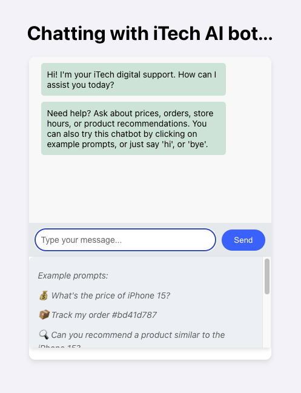
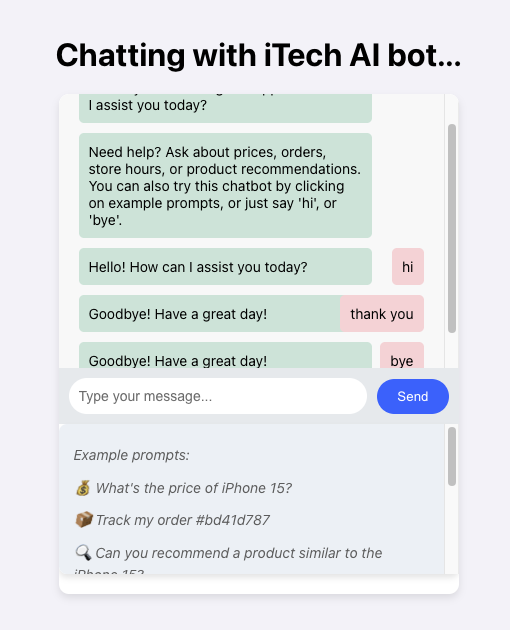
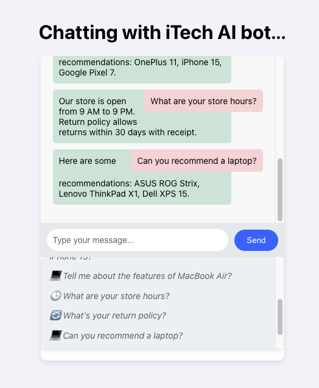

# Chatbot for Product Inquiry and Order Tracking of a retail store

This is an AI-powered chatbot for a retail store, leveraging NLP (Natural Language Processing) with spaCy and FastAPI. It helps users with product inquiries, order tracking, recommendations, FAQs, and more. It understands various ways users phrase their questions and provides relevant responses.

[Click here to watch the demo](https://private-user-images.githubusercontent.com/121528869/412168889-89a06a3d-dfb3-4b41-84e8-dab8b82b3519.mp4?jwt=eyJhbGciOiJIUzI1NiIsInR5cCI6IkpXVCJ9.eyJpc3MiOiJnaXRodWIuY29tIiwiYXVkIjoicmF3LmdpdGh1YnVzZXJjb250ZW50LmNvbSIsImtleSI6ImtleTUiLCJleHAiOjE3MzkzMDg4NTEsIm5iZiI6MTczOTMwODU1MSwicGF0aCI6Ii8xMjE1Mjg4NjkvNDEyMTY4ODg5LTg5YTA2YTNkLWRmYjMtNGI0MS04NGU4LWRhYjhiODJiMzUxOS5tcDQ_WC1BbXotQWxnb3JpdGhtPUFXUzQtSE1BQy1TSEEyNTYmWC1BbXotQ3JlZGVudGlhbD1BS0lBVkNPRFlMU0E1M1BRSzRaQSUyRjIwMjUwMjExJTJGdXMtZWFzdC0xJTJGczMlMkZhd3M0X3JlcXVlc3QmWC1BbXotRGF0ZT0yMDI1MDIxMVQyMTE1NTFaJlgtQW16LUV4cGlyZXM9MzAwJlgtQW16LVNpZ25hdHVyZT1jZjUxNjA1ZTM5ODJmYTAwZTQwMTM2MGIxMzRjZWZhYTdiYTZhYWExYWRkYmZlNjJiNjVhZmQwZTc5Y2ZmZmMxJlgtQW16LVNpZ25lZEhlYWRlcnM9aG9zdCJ9.rpmQmka1QwVu2my0jHBErqTDKruSzW_Cf0vPPkJTHcg)  

## Features
- **Product Inquiry**: Ask about product availability, price, and details.
- **Order Tracking**: Track orders using an order ID.
- **Product Recommendations**: Get similar product suggestions.
- **FAQs**: Ask about store policies, return policies, and working hours.
- **Natural Language Understanding**: Recognizes different ways of asking the same question.

## Technologies Used
### Frontend:
- **React.js** (User interface for chatbot)
- **CSS** (Styling)
- **Node.js** (Dependency management)

### Backend:
- **Python** (FastAPI(Panda))
- **spaCy** (Natural Language Processing)
- **Scikit-Learn** (Machine Learning for recommendations)
- **Regex** (User input parsing)

- **Database**: SQLite (storing product details and order tracking data)

## Example Prompts
You can try this chatbot by clicking on example prompts in the UI or typing manually. Checkout csv database folder to find other products & orders to test. Example queries:

- **Product Inquiry:**
  - "What's the price of iPhone 15?"
  - "Do you have iPad Pro in stock?"
  - "Is MacBook Air available?"
  - "Tell me about the features of iPad Pro."
  - "How is Macbook Air"

- **Order Tracking:**
  - "Track my order #12345678"
  - "Where is my order #98765432?"

- **Product Recommendations:**
  - "Can you recommend a product similar to iPhone 15?"
  - "Suggest a good laptop."
  - "Can you recommend a phone?"

- **FAQs:**
  - "What is your return policy?"
  - "What are your store hours?"

- **Casual Conversations:**
  - "Hi", "Hello", "Hey"
  - "Bye", "See you", "Take care"

## Demo & Screenshots

## Installation
### **1. Clone the repository**
git clone https://github.com/jnima2022/retail_chatbot.git
cd retail_chatbot

### **2. Set up a virtual environment**
python -m venv venv
source venv/bin/activate  # Mac/Linux
venv\\Scripts\\activate  # Windows

### **3. Install dependencies**
pip install -r requirements.txt

### **4. Set up the database**
python database_setup.py

### **5. Run the backend**
uvicorn backend:app --reload

### **6. Run the frontend**
cd chatbot-ui
npm install  # Install dependencies
npm start    # Start the React app

## Requirements
- **Python 3.11** or lower (Recommended, as Python 3.13 may cause issues)
